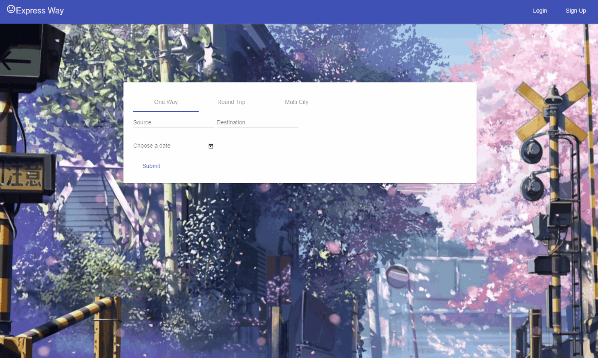

# ExpressWay


**Development Environment:** IntelliJ IDEA, MySQL
* Spring + SpringMVC + Hibernate, Maven
* HTML, CSS/SCSS, JavaScript, AngularJS

**Developer** [Melanie Lin](https://github.com/captain-melanie), [Bin Zhou](https://github.com/bizzhou), [Yuening Li]()

## How to run frontend

install nodejs and npm - google

```
cd frontend
npm install -g @angular/cli
npm install

ng serve
type localhost:4200 to view page

ng serve will create a dummie server for the angular app
```
For more details, google angular-cli



## How to run backend
1. Create an artifact
```
Click File -> Project Structure -> Artifacts -> + -> Web Application Exploded
```
2. Download Tomcat Server 8.0
3. Follow [this instruction](https://www.mkyong.com/intellij/intellij-idea-run-debug-web-application-on-tomcat) to configure Tomcat Server on IntelliJ IDEA

## Log

## Fixes
- Add Person table into the database schema, edit the insert files.
